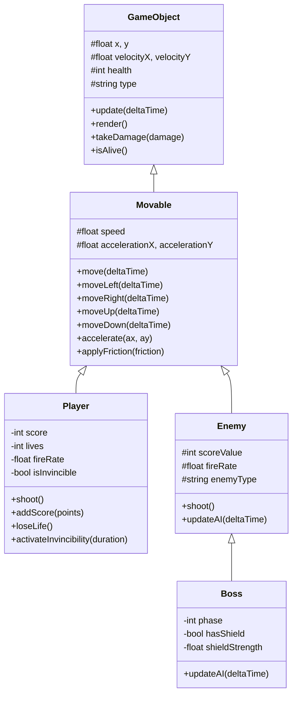
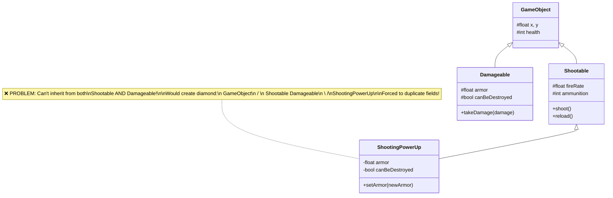
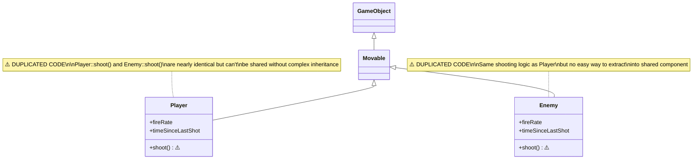
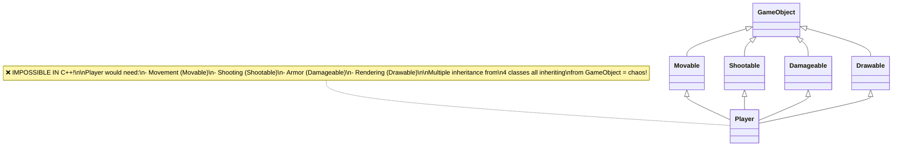

# OOP Architecture PoC - Class Diagrams & Analysis

## 📅 Spike Information
- **Period**: 26/11/2025 - 27/11/2025
- **Related Issue**: #51 - [Spike] [Main] Engine Architecture PoC (ECS vs OOP)

## 🎯 Objective
Test traditional OOP inheritance approach for R-Type game architecture and identify complexity issues.

---

## 📊 Class Diagram - Basic Hierarchy



**Analysis:**
- ✓ Clear hierarchy initially
- ✗ Depth = 4 levels for Boss (GameObject → Movable → Enemy → Boss)
- ✗ `shoot()` method duplicated in Player and Enemy
- ✗ All objects have movement data, even if stationary

---

## 💎 Diamond Inheritance Problem



**Analysis:**
- ❌ **Diamond Problem**: Cannot inherit from both Shootable and Damageable
- ❌ **Duplication**: Had to duplicate `armor` and `canBeDestroyed` fields
- ❌ **Virtual Inheritance**: Would solve it but adds complexity and performance cost
- ❌ **Composition**: Requires many forwarding methods (wrapper hell)

---

## 🔄 Attempted Behavior Sharing



**Problem**: To share shooting behavior, we would need:

```
Option 1: Extract to Shootable base class
    GameObject → Shootable → Movable → Player  ❌ Complicated!
    GameObject → Shootable → Movable → Enemy   ❌ Deeper hierarchy!

Option 2: Multiple inheritance
    Player inherits from Movable AND Shootable  ❌ Diamond problem!
    
Option 3: Composition
    Player HAS-A ShootingComponent  ✓ But verbose, not idiomatic OOP
```

---

## 🧩 Real-World Complexity Example



---

## 📈 Complexity Analysis

### Metrics

| Metric | Value | Assessment |
|--------|-------|------------|
| **Total Lines of Code** | ~800 | 🟡 Medium for basic features |
| **Maximum Inheritance Depth** | 4 levels | 🔴 High (Boss class) |
| **Code Duplication** | shoot() in 2 places | 🔴 High maintenance cost |
| **Number of Virtual Functions** | 8+ | 🟡 Performance overhead |
| **Coupling** | Very High | 🔴 Fragile base class |

### Problems Identified

#### 1. ❌ Code Duplication
```cpp
// Player.cpp
void Player::shoot() {
    if (timeSinceLastShot >= fireRate) {
        std::cout << "PEW PEW!" << std::endl;
        timeSinceLastShot = 0.0f;
    }
}

// Enemy.cpp
void Enemy::shoot() {  // ⚠️ DUPLICATED!
    if (timeSinceLastShot >= fireRate) {
        std::cout << "Enemy shooting!" << std::endl;
        timeSinceLastShot = 0.0f;
    }
}
```

#### 2. ❌ Fragile Base Class
```cpp
// Change GameObject::update()
void GameObject::update(float deltaTime) {
    // Add new feature
    checkCollisions();  // ⚠️ Affects ALL 10+ subclasses!
}
```

#### 3. ❌ Inflexibility
```cpp
// Want to make Player temporarily faster?
Player player;
// ❌ Can't do: player.addComponent<SpeedBoost>();
// ❌ Must change Player class or create PowerUpPlayer subclass
```

#### 4. ❌ Memory Layout (Cache Inefficiency)
```cpp
std::vector<GameObject*> objects;  // Pointers scattered in memory
// Enemy at 0x1000
// Player at 0x5000  ← Cache miss!
// Boss at 0x9000    ← Cache miss!
// Enemy at 0x2000   ← Cache miss!

// Can't do: "Process all Movable objects"
// without dynamic_cast or visitor pattern
```

---

## 🎯 Questions Answered

### ❓ Is standard OOP inheritance easier to understand?

**Answer: Yes initially, but NO as complexity grows**

#### ✅ Pros (Easy to understand):
- Intuitive "is-a" relationships (Player *is a* Movable)
- Familiar to most programmers
- Polymorphism works naturally
- Good for simple hierarchies (2-3 levels)

#### ❌ Cons (Becomes hard to understand):
- Deep hierarchies are hard to trace (Boss → Enemy → Movable → GameObject)
- Diamond problem is confusing and unintuitive
- "Fragile base class" behavior is surprising
- Can't easily see what a class *actually does* (behavior hidden in parents)
- Tight coupling makes changes risky

### Example: Understanding Boss Behavior

```cpp
// To understand what Boss can do, you must check:
Boss boss;           // 1. Check Boss class
// Also check:        // 2. Check Enemy class (parent)
                     // 3. Check Movable class (grandparent)
                     // 4. Check GameObject class (great-grandparent)
                     // 5. Check which methods are overridden at each level
                     // 6. Remember virtual function resolution order

// Total: Need to read 4+ files to understand one class! 😵
```

---

## ✅ Exit Criteria Met

### 1. Class Hierarchy Created ✅
- GameObject → Movable → Player ✅
- GameObject → Movable → Enemy → Boss ✅

### 2. Behavior Sharing Attempted ✅
- Shooting behavior in Player and Enemy
- Identified duplication problem
- Demonstrated diamond inheritance issue

### 3. Diamond Inheritance Problems Identified ✅
- Shootable + Damageable cannot be combined
- Virtual inheritance is complex
- Composition leads to wrapper hell
- Code duplication when avoiding multiple inheritance

### 4. Class Diagram Delivered ✅
- See Mermaid diagrams above

### 5. Complexity Analysis Completed ✅
- See detailed metrics and problems above

---

## 🔬 Conclusion

### Understanding Complexity: ⚠️ MEDIUM (starts simple, grows exponentially)

| Aspect | Rating | Notes |
|--------|--------|-------|
| **Initial Learning Curve** | ⭐⭐⭐⭐ | Easy to start |
| **At Scale** | ⭐ | Becomes very complex |
| **Maintainability** | ⭐⭐ | Hard to change base classes |
| **Flexibility** | ⭐ | Can't change behavior at runtime |
| **Performance** | ⭐⭐ | Virtual calls, cache misses |
| **Testability** | ⭐⭐ | Must mock entire hierarchy |

### Verdict

**OOP inheritance is easier to understand for small projects**, but **becomes a complexity nightmare for games like R-Type** where:
- Many entity types exist (10+ enemy types)
- Behaviors need to be shared (shooting, movement, collision)
- Power-ups change behavior dynamically
- Performance matters (1000+ entities)

### Recommendation

🚀 **Proceed with ECS implementation PoC** to compare:
- Composition over inheritance
- Data-oriented design
- Runtime behavior changes
- Cache-friendly memory layout
- Easier testing and maintenance

---

## 📚 References

- **Issue**: #51 - Engine Architecture PoC (ECS vs OOP)
- **Related Files**:
  - `/PoC/oop_test/GameObject.hpp`
  - `/PoC/oop_test/Movable.hpp`
  - `/PoC/oop_test/Player.hpp`
  - `/PoC/oop_test/Enemy.hpp`
  - `/PoC/oop_test/DiamondProblem.hpp`
  - `/PoC/oop_test/main.cpp`

---

*Generated as part of R-Type Engine Architecture Spike - 26/11/2025*
