# ECS Architecture - UML and Sequence Diagrams

This document provides comprehensive UML diagrams to understand the complete architecture of the Entity Component System (ECS).

---

## Table of Contents

1. [Class Diagram - Complete Architecture](#class-diagram---complete-architecture)
2. [Component Diagram - Module Organization](#component-diagram---module-organization)
3. [Sequence Diagrams](#sequence-diagrams)
   - [Entity Lifecycle](#entity-lifecycle)
   - [Component Management](#component-management)
   - [View Iteration](#view-iteration)
   - [Parallel Processing](#parallel-processing)
   - [Signal Dispatching](#signal-dispatching)
4. [State Diagrams](#state-diagrams)
5. [Deployment Diagram](#deployment-diagram)

---

## Class Diagram - Complete Architecture


---

## Component Diagram - Module Organization

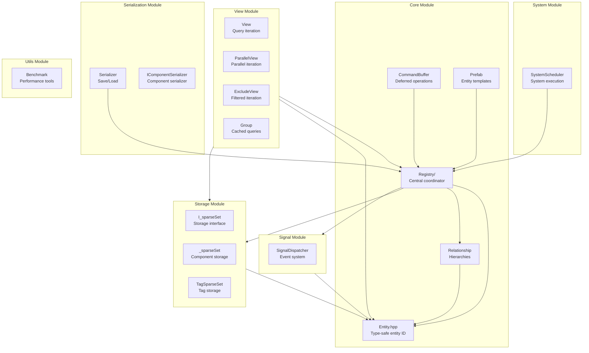

---

## Sequence Diagrams

### Entity Lifecycle

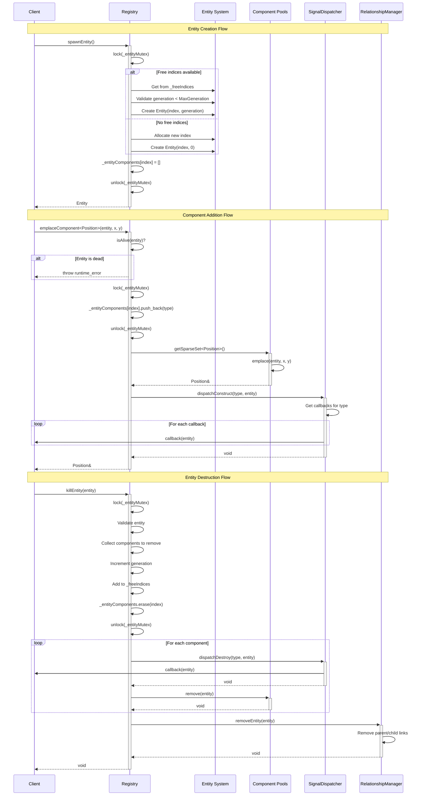

### Component Management

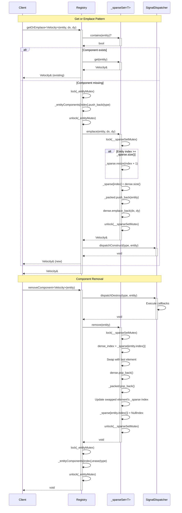

### View Iteration

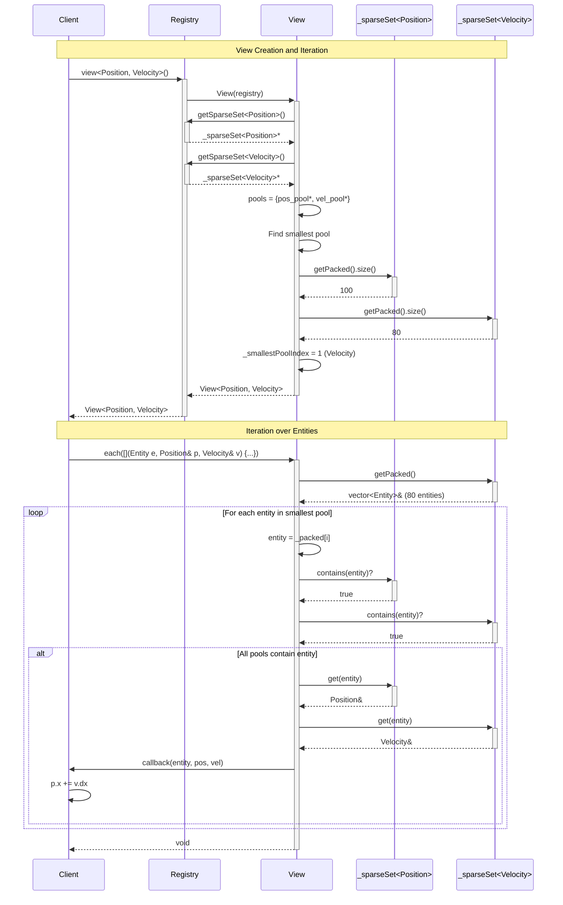

### Parallel Processing

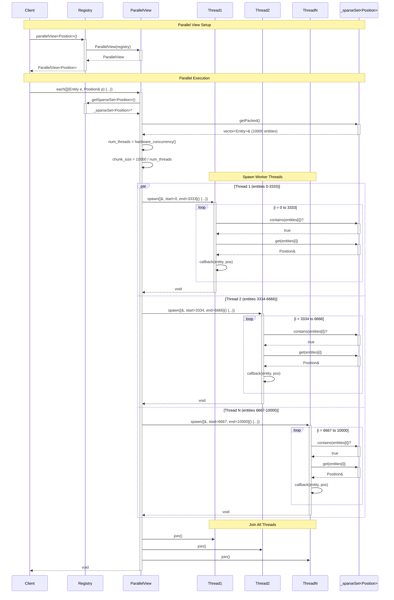

### Signal Dispatching

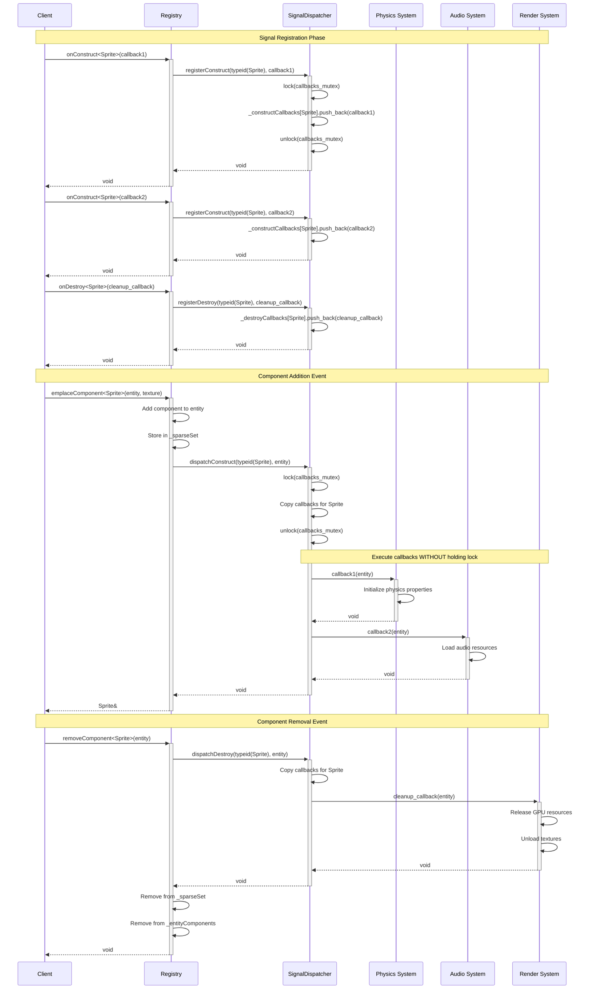

### Command Buffer Deferred Operations

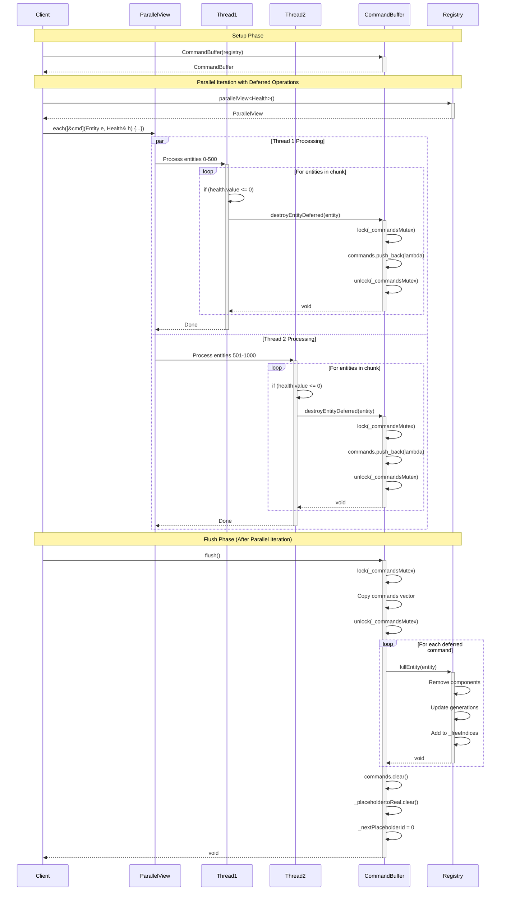

### System Scheduler Execution

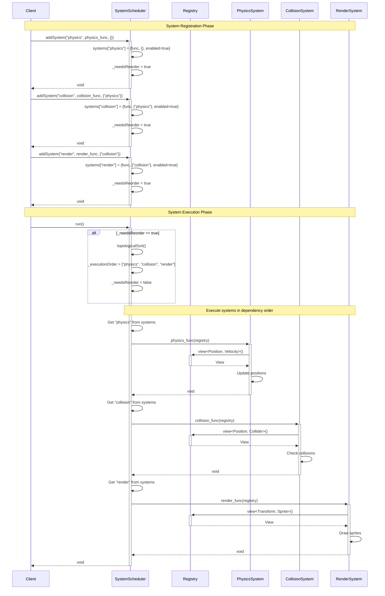

---

## State Diagrams

### Entity State Machine

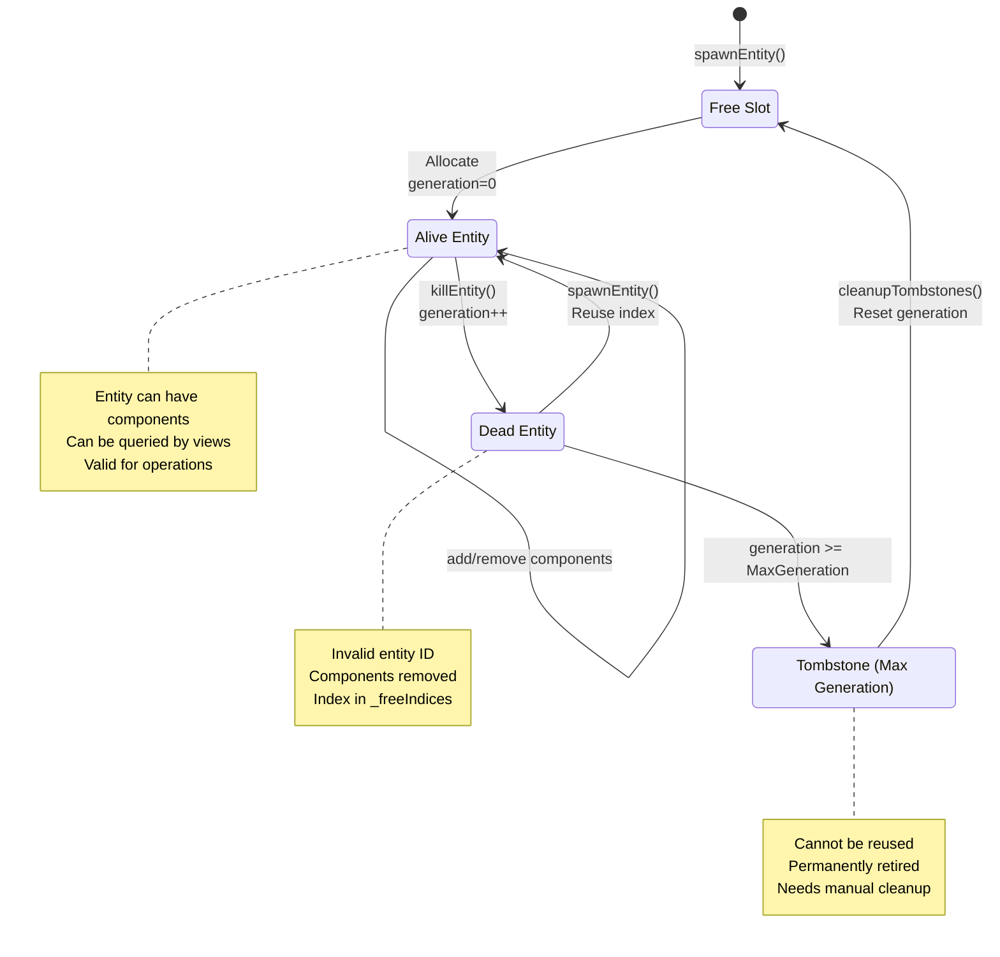

### Component Lifecycle

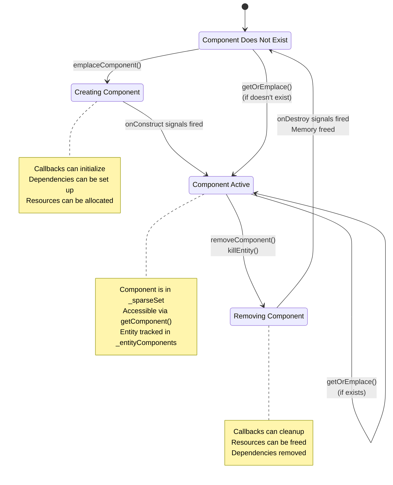

---

## Deployment Diagram

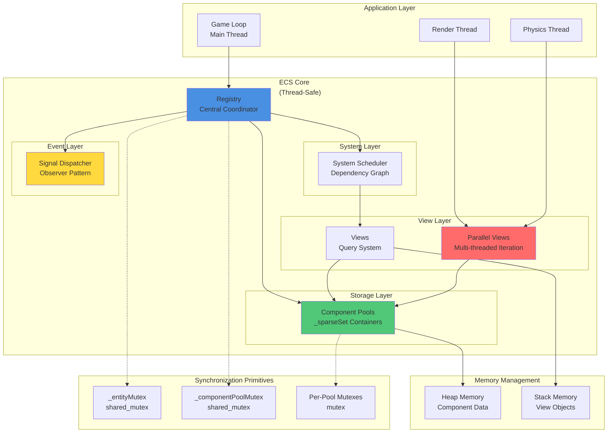

---

## Architecture Summary

### Key Design Patterns

1. **Entity-Component-System (ECS)**: Core architectural pattern
2. **_sparse Set**: Efficient component storage with O(1) operations
3. **Observer Pattern**: Signal system for component lifecycle events
4. **Command Pattern**: Deferred operations via CommandBuffer
5. **Prototype Pattern**: Prefab system for entity templates
6. **Strategy Pattern**: System scheduler with pluggable systems
7. **Iterator Pattern**: Views for component traversal
8. **Dependency Injection**: Registry passed to systems
9. **Object Pool**: Entity recycling with generations
10. **Flyweight Pattern**: Tag components with zero memory overhead

### Thread Safety Model

```
┌─────────────────────────────────────────────────────────┐
│                    Thread-Safe Operations                │
├─────────────────────────────────────────────────────────┤
│ ✓ Concurrent reads (multiple threads)                   │
│ ✓ Parallel view iteration (different components)        │
│ ✓ Signal registration (with locking)                    │
│ ✓ Entity creation/destruction (with locking)            │
├─────────────────────────────────────────────────────────┤
│                  Unsafe Operations                       │
├─────────────────────────────────────────────────────────┤
│ ✗ Structural changes during parallel iteration          │
│ ✗ Modifying same component from multiple threads        │
│ ✗ Adding/removing components during view iteration      │
└─────────────────────────────────────────────────────────┘
```

### Memory Layout

```
Registry Memory Hierarchy:
├── Stack (lightweight)
│   ├── Entity (8 bytes)
│   ├── View objects (16-32 bytes)
│   └── Iterators (8-16 bytes)
│
└── Heap (component data)
    ├── _sparseSet::dense (contiguous components)
    ├── _sparseSet::_packed (entity IDs)
    ├── _sparseSet::_sparse (index lookup)
    └── Relationship graphs
```

---

**Document Version**: 1.0  
**Last Updated**: November 21, 2025  
**Author**: ECS Architecture Team
